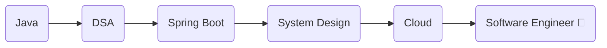

<div align="center">

# 👋 Hi, I'm Sanjeev Sivalingam


</div>

---

# 💫 About Me

🎓 Computer Science Engineering Student at **V.S.B Engineering College**

💻 Passionate Full Stack Developer

🤖 Exploring Artificial Intelligence & Machine Learning

🔐 Interested in Cybersecurity

🌱 Currently learning

- Java
- Data Structures & Algorithms
- Spring Boot
- System Design
- Artificial Intelligence

🎯 Goal

> Become a Software Engineer and build impactful AI-powered products.

---

# 🌐 Connect With Me

<p align="center">

<a href="mailto:sanjeevsivalingam1438@gmail.com">

</a>

<a href="https://github.com/SANJEEV1438">

</a>

<a href="https://www.linkedin.com/in/sanjeev-sivalingam">

</a>

<a href="https://sanju10-portfolio.netlify.app/">

</a>

</p>

---

# 💻 Tech Stack

<div align="center">

[](https://skillicons.dev)

</div>

---

# 🚀 Featured Projects

## 🏫 Smart Classroom Management System

> AI-powered classroom management platform

✨ Attendance

✨ Student Dashboard

✨ Faculty Dashboard

✨ Notes Sharing

✨ Announcements

✨ AI Integration

---

## 📄 AI Resume Analyzer

✅ ATS Score

✅ Missing Keywords

✅ Grammar Analysis

✅ Resume Improvement

✅ Resume Comparison

---

## 💰 Crypto Portfolio Tracker

React + Spring Boot + PostgreSQL

Features

- Live Portfolio
- Profit & Loss
- Scam Detection
- Risk Analysis
- Analytics Dashboard

---

## 🤝 SkillSwap AI

AI-powered student skill exchange platform where students can teach and learn from each other.

---

# 📊 GitHub Analytics

<p align="center">


</p>

---

# 🔥 GitHub Streak

<p align="center">


</p>

---

# 🏆 GitHub Trophies

<p align="center">


</p>

---

# 📈 Contribution Graph

<p align="center">


</p>

---

# 🐍 Contribution Snake

> Enable GitHub Actions to generate this automatically.

```yaml
name: Generate Snake

on:
  schedule:
    - cron: "0 */12 * * *"

jobs:
  build:
    runs-on: ubuntu-latest

    steps:
      - uses: Platane/snk@master
        with:
          github_user_name: SANJEEV1438
          svg_out_path: dist/github-contribution-grid-snake.svg
```

Display it:

```md

```

---

# 💡 Current Focus

```text
✔ Java Development
✔ Spring Boot
✔ React
✔ AI Projects
✔ DSA
✔ Open Source
✔ Problem Solving
```

---

# 📚 Learning Journey



---

# 💬 Dev Quote

> **"Code. Learn. Build. Repeat."**

---

# ⚡ Fun Fact

```yaml
Name: Sanjeev Sivalingam

Country: India 🇮🇳

Role: Computer Science Student

Passion:
  - Full Stack
  - AI
  - Cybersecurity

Dream:
  Build products used by millions 🚀
```

---

<div align="center">

### ⭐ Thanks for visiting my profile!

If you like my work, consider giving a ⭐ to my repositories.


</div>
